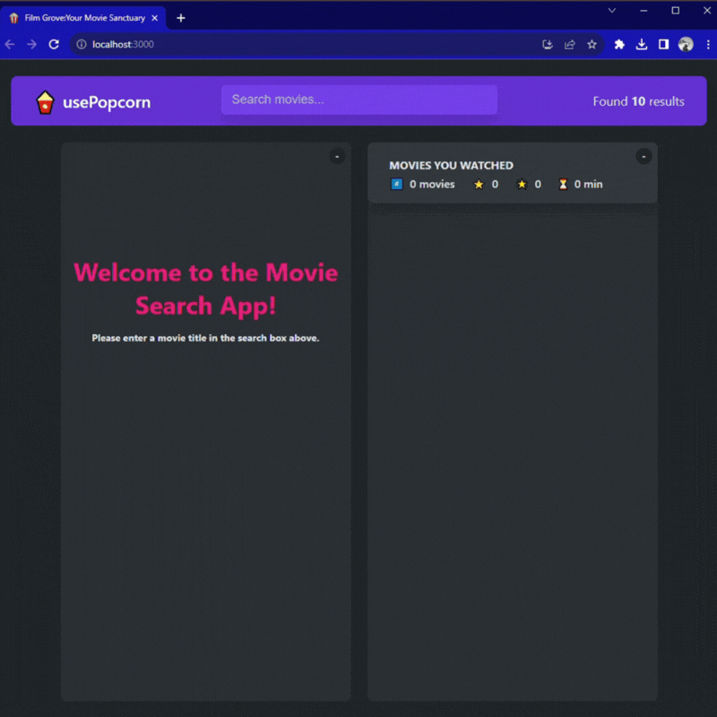

# FilmGrove

  

FilmGrove is your ultimate movie companion, empowering you to explore, save, rate, and indulge in cinematic delights with ease.

## Features

- **Search Movies:** Effortlessly search for your favorite movies and discover new ones to watch.

- **Watchlist:** Keep track of movies you want to watch by saving them to your personalized watchlist.

- **Rate Movies:** Rate and review movies after watching to keep a record of your thoughts.

- **Remove from Watched:** Easily remove movies from the watched list if you wish to do so.

## Website

The live website is accessible at [Film-Grove.netlify.app](https://film-grove.netlify.app).

## How to Use

1. Visit [Film-Grove.netlify.app](https://film-grove.netlify.app) to access the app.

2. Start exploring movies by using the search feature or browsing the collection.

3. Save movies you want to watch to your watchlist.

4. Rate movies after watching and leave reviews.

5. Remove movies from the watched list if desired.

## Technologies Used

- React.js
- JavaScript
- HTML
- CSS

## License

This project is licensed under the [MIT License](LICENSE).

---

Enjoy the magic of FilmGrove, your one-stop movie haven. Happy movie watching! 🎥🍿
